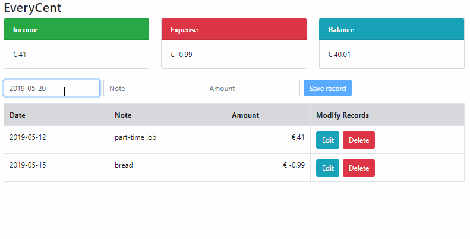

## react-everyCent

A clear and concise Budget Web App allows users to track their expenses.  
This CRUD web application demonstrate how to send HTTP requests to GET, PUT, POST and DELETE data to a REST API.  

Developed by using Javascript(ES6), React, Redux, Axios, Bootstrap.  

### Features  
- GET records from a REST API.  
- POST records to a REST API.  
- Edit record and sync to the REST API.  
- Delete record and sync to the REST API.  
- Cash flow calculation.  
  

### Directory tree
```bash
react-everyCent
├─public
│
└─src
   │
   ├─components
   │       cashFlow.js      (to display cash flow calculation)
   │       list.js          (main component)
   │       record.js        (to handle CRUD)
   │       recordForm.js    (for user to input record)
   │
   ├─demoGIF
   │
   └─utils
           dataAPI.js       (to send requests to the REST API)

  db.json
  package.json
  README.md

```

### To use
This web application is based on [create-react-app](https://github.com/facebook/create-react-app#creating-an-app "create-react-app") to build. Please make sure that you have Node 8.10.0 and npm 5.2 or above on your local development machine.  

> I encountered an unsuccessful installation issue when I used npx, therefore, I switched to yarn.  


After that, clone this repository and install it, then run it locally `http://localhost:3000/`  

`git clone https://github.com/miaoT/react-everyCent.git`  

`cd react-everyCent`  


`yarn install`  

`yarn start`  
  

### Note

Avoid declaring the fixed url, and consider its flexibility, you can create a custom environment variable beginning with `REACT_APP_`.   
For example, 

```js
const api = process.env.REACT_APP_DATA_API_URL
```

You can also create a file `.env.development.local` in your root directory, and declare the custom environment variable.   
For example,
```
  REACT_APP_DATA_API_URL=
```  
In `.env.development.local` this file, you can put all API urls that you would be used in this development.
  
> Reference: https://facebook.github.io/create-react-app/docs/adding-custom-environment-variables  

  
#### Demo

 